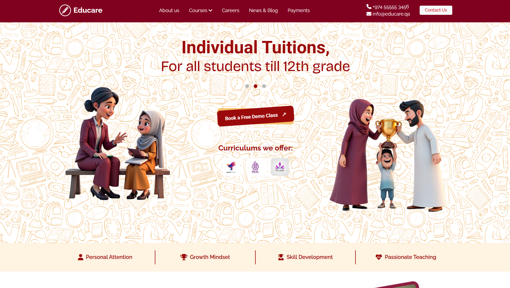

# 📄 HTML Project using CSS & jQuery

## 🚀 Project Overview

This is a front-end web project developed using **HTML**, **CSS**, and **jQuery**. It showcases responsive design, interactive UI components, and smooth user experience with minimal JavaScript overhead.

## ✨ Features

- Clean and responsive layout using HTML5 and CSS3  
- Interactive elements and animations using jQuery  
- Cross-browser compatibility  
- Simple and reusable code structure  
- Mobile-friendly design

## 🛠️ Technologies Used

- **HTML5** – Markup language for structuring the content  
- **CSS3** – Styling and responsive layout  
- **jQuery** – Simplified DOM manipulation and event handling

## 📁 Project Folder Structure

<pre>
📦 project-root
├── 📄 index.html            # Main HTML file (all content and layout)
└── 📁 assets
    ├── 📁 css
    │   └── 🎨 style.css     # Custom styles for the project
    ├── 📁 fonts             # Fonts folder (currently empty)
    ├── 📁 img               # All images used in the project
    │   └── 🖼️ [image files...]
    └── 📁 js
        └── ⚙️ script.js     # JavaScript/jQuery code for functionality
</pre>

## 🧑‍💻 How to Run

1. Clone the repository or download the ZIP  
2. Open `index.html` in your browser  
3. Ensure internet connection for jQuery CDN (or use a local jQuery file if included)

## 📌 Notes

- Make sure jQuery is properly linked in the HTML before the script file.
- Customize styles and scripts according to your project needs.

### 🖼️ Screenshot

